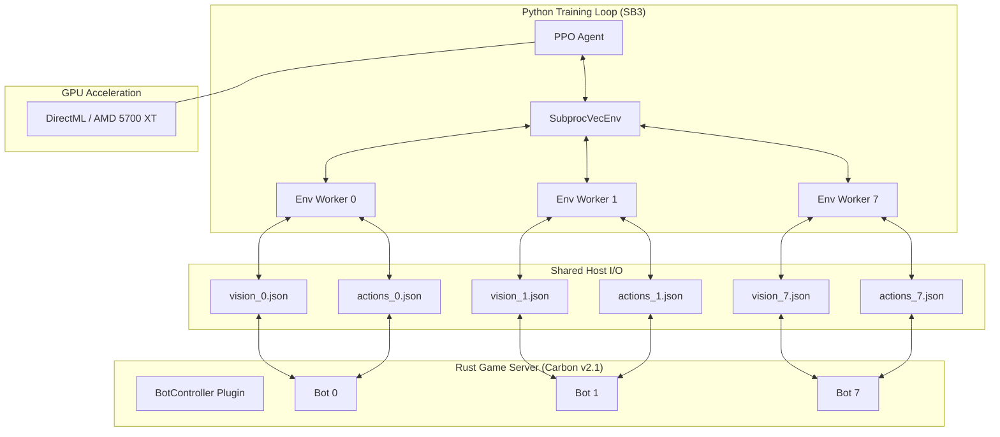

# Rust RL Architecture: Multi-Bot Parallelization

This document explains the high-performance training architecture implemented for the Rust Reinforcement Learning agent (v2_modular) using an AMD 5700 XT.

## System Overview

The system transitions from a single-agent bottleneck to an **8-way parallel stream** to maximize GPU compute saturation.

## Core Components

### 1. The Carbon Plugin (`BotController.cs`)
- **Multi-Bot Management**: Spawns 8 autonomous entities (`Bot_0` to `Bot_7`) on server initialization.
- **Indexed Handshake**: Each bot listens specifically to its own action file (e.g., `actions_3.json`) and reports its vision to its own vision file (e.g., `vision_3.json`).
- **Low Latency**: Runs on a 100ms timer (10 ticks/sec), providing high-frequency updates to the agent.

### 2. The Python Environment (`environment.py`)
- **Vectorized Wrapper**: Implements the `gymnasium.Env` interface with a `bot_id` parameter.
- **Zero-Wait Step**: Removed all `time.sleep` calls to allow the Python workers to spin at maximum CPU speed during data collection.

### 3. The Training Loop (`train.py`)
- **SubprocVecEnv**: Uses Python's `multiprocessing` to run 8 environments in parallel. This bypasses the Global Interpreter Lock (GIL) and allows massive data collection speed.
- **Extreme Scaling**:
    - `batch_size = 1024`: Large matrices to saturate the AMD 5700 XT compute units.
    - `n_steps = 4096`: Collects a massive amount of data before the "GPU Update Phase."
    - `n_epochs = 30`: Forces the GPU to perform 30 passes over the data to keep power consumption and clocks high.

### 4. DirectML Integration
- Uses `torch_directml` to target the AMD Radeon RX 5700 XT.
- **VRAM Utilization**: Uses ~3.5GB of the 8GB available, leaving plenty of headroom for the high-resolution Rust server assets.

## Monitoring

- **Weights & Biases**: Real-time cloud dashboard for tracking `live_step`, `SPS`, and environmental achievements (Wood/Cloth harvested).
- **Local Dashboard**: `local_dashboard.html` provides a zero-latency view of the bots' raw JSON data directly from the `shared-data` folder.

## Project Metrics (Snapshot 2026-03-30)

| Metric | Count |
|--------|-------|
| **Git-Tracked Files** | 2,540 |
| **Total Lines of Code** | 197,032 |
| **Active Bots** | 8 |
| **GPU Target** | AMD Radeon RX 5700 XT |
